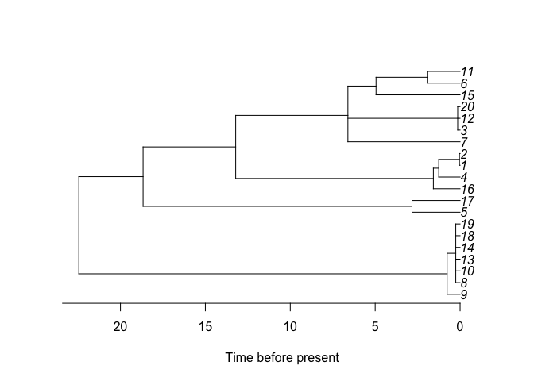

<!-- README.md is generated from README.Rmd. Please edit that file -->

# Introduction

This package implements an ancestral process for infectious disease
outbreaks with superspreading.

## Installation

You can install EpiLambda from github with:

``` r
devtools::install_github("xavierdidelot/EpiLambda")
```

The package can then be loaded using:

``` r
library(EpiLambda)
#> Loading required package: ape
```

## Example

Consider that the offspring distribution is Negative-Binomial with
dispersion parameter $r=0.5$. To simulate the ancestry of a sample of
size 20 in a population of size 40:

``` r
t=omega_simtree(n=20,nt=40,r=0.5)
plot(t)
axisPhylo(1)
title(xlab='Generations since present')
```

<!-- -->

## More information and getting help

For more detailed examples of how to use EpiLambda, see the vignettes
[here](https://github.com/xavierdidelot/EpiLambda/tree/master/vignettes).
See also the help included in the package using the R command
`help(package='EpiLambda')`.

If you have any problem or question please create an issue
[here](https://github.com/xavierdidelot/EpiLambda/issues) or get in
touch by emailing `xavier.didelot@gmail.com`
